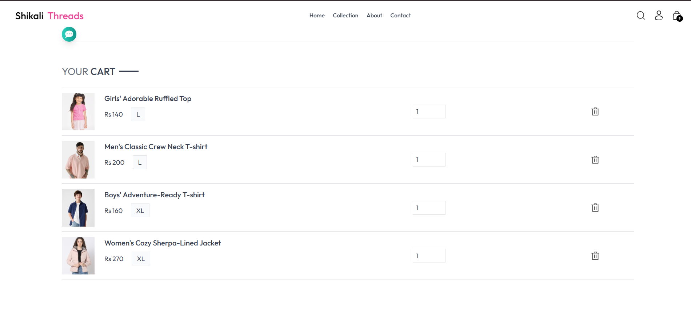

# 🧵 Shikali Threads  
**Modern MERN E-commerce Platform for Handcrafted Nepali Textiles**

<p align="center">
  
</p>

---

## 📌 Overview

Shikali Threads is a culturally inspired e-commerce platform built using the **MERN Stack (MongoDB, Express.js, React.js, Node.js)**.  
It promotes **handcrafted textiles**, empowering Nepali artisans by providing a digital marketplace to showcase and sell their craft globally.

✨ Key Principles:  
- Support local artisan communities  
- Sustainable & fair trade practices  
- Preserve Nepal’s weaving heritage  
- Provide a modern digital shopping experience  

---

## 🚀 Tech Stack

| Layer        | Technology Used |
|-------------|----------------|
| Frontend    | React.js, TailwindCSS |
| Backend     | Node.js, Express.js |
| Database    | MongoDB Atlas |
| Auth        | JWT Authentication |
| Deployment  | vercel |

---

## 🛍️ Features

✅ Modern User Interface (Fully Responsive)  
✅ Product Search & Filtering  
✅ Add to Cart / Wishlist / Checkout Flow  
✅ Role-based Authentication (User + Admin)  
✅ Product & Inventory Management  
✅ Secure REST API  
✅ Artisan-oriented branding and content  

---

## 🧩 Folder Structure (Frontend)

```
Shikali-Threads-Frontend/
│
├── public/
├── src/
│   ├── assets/
│   │   └── github_assets/ (Images used in README)
│   ├── components/
│   ├── pages/
│   ├── redux or context/
│   └── App.jsx
└── package.json
```

---

## 📸 Screenshots

<p align="center">
  
  <br><em>Homepage showcasing featured handcrafted products</em>
</p>

---

<p align="center">
  
  <br><em>Product detail page with add-to-cart functionality</em>
</p>

---

<p align="center">
  
  <br><em>Shopping cart interface</em>
</p>

---

<p align="center">
  
  <br><em>Admin dashboard to manage products & orders</em>
</p>

---

## 🏗️ Installation & Setup

### Clone Repository

```bash
git clone https://github.com/Prensu/Shikali-Threads-Frontend.git
cd Shikali-Threads-Frontend
```

### Install Dependencies

```bash
npm install
```

### Run App

```bash
npm run dev
```

Backend repo: _(Add link here when available)_

---

## 🔐 Environment Variables

Create a `.env` file inside the `backend/` folder:

```
MONGO_URI=your_mongodb_url
JWT_SECRET=your_secret_key
CLOUDINARY_API_KEY=
CLOUDINARY_CLOUD_NAME=
CLOUDINARY_API_SECRET=
```

> ⚠️ Never push `.env` to GitHub

---

## 📦 Future Enhancements

- Online payments integration (**eSewa / Khalti / Stripe**)
- Personalized product recommendations (AI-powered)
- Order tracking & SMS notifications
- Multilingual UI (English + Nepali)
- Subscription model for exclusive artisan drops

---

## 👥 Credits

| Role | Contribution |
|------|--------------|
| Developers | Prensu & Team |
| Artisans | Local Nepalese weaving groups |
| Inspiration | Nepal’s cultural heritage |

---

## 📜 License

This project is licensed under the **MIT License**.

---

## ⭐ Support

If you like this project, please **⭐ Star** the repository to support further development!

