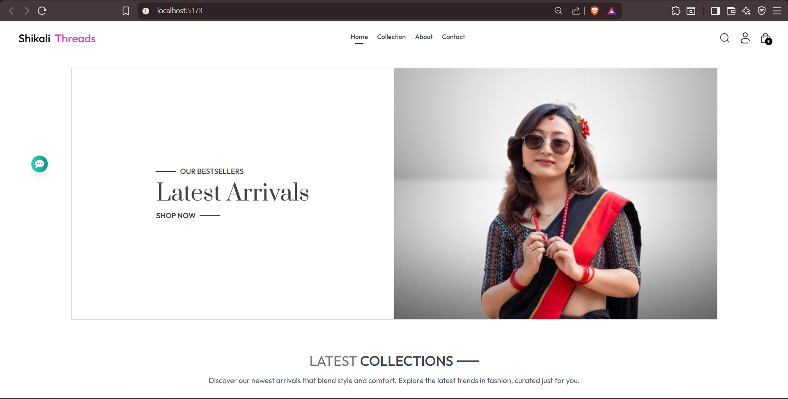
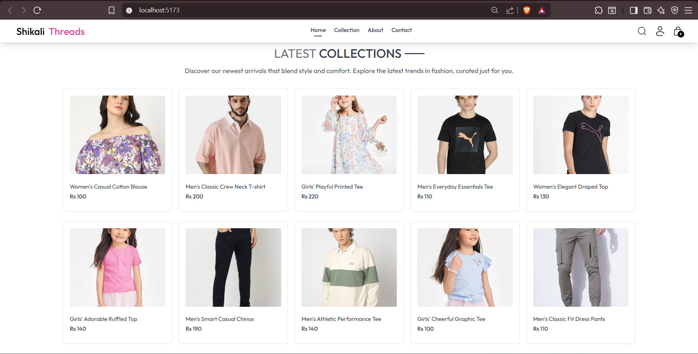
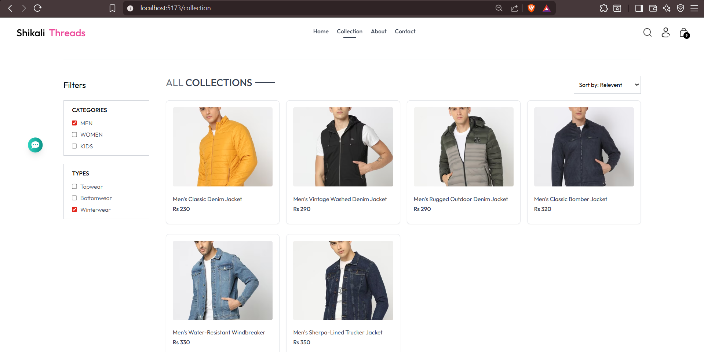
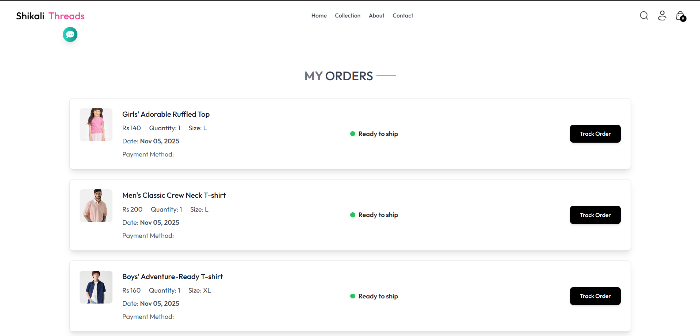
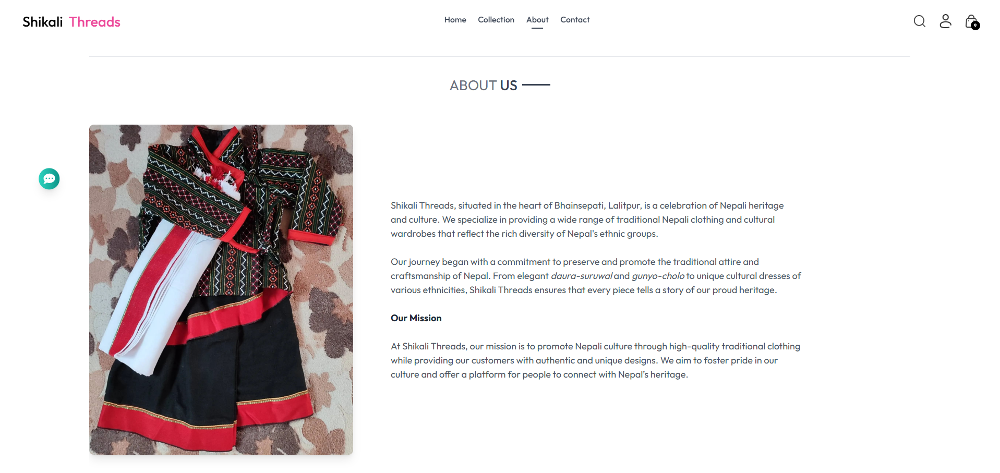
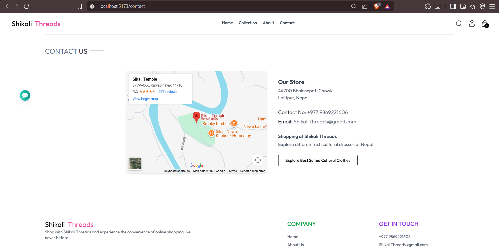

# 🧵 Shikali Threads  
A MERN-based e-commerce platform for promoting Nepali handcrafted textile products.

<p align="center">
  
</p>

---

## 📌 About the Project

Shikali Threads aims to support Nepal’s traditional weaving culture by connecting **local artisans** to **modern online customers**.  
Users can browse, explore, and order beautiful handmade textile products like scarves, threads, and decorative items.

🎯 Main Goals  
- Showcase local craftsmanship  
- Promote cultural and sustainable products  
- Build an easy and modern online shopping experience  

---

## 🚀 Tech Stack

| Section | Technologies |
|--------|--------------|
| Frontend | React.js, Tailwind CSS |
| Backend | Express.js, Node.js |
| Database | MongoDB |
| Authentication | JWT (JSON Web Token) |

---

## 🛍️ Key Features

- Simple and responsive UI
- Add to cart and product browsing
- User authentication (Login/Register)
- Admin dashboard for managing items
- Organized product display

---

## 📸 Screenshots

### ✅ Homepage
<p align="center">
  
</p>

---

### ✅ Product Page
<p align="center">
  
</p>

---

### ✅ Cart Page
<p align="center">
  
</p>

---

### ✅ Order Page
<p align="center">
  
</p>


---

### ✅ About Page
<p align="center">
  
</p>

---

### ✅ Contact Page
<p align="center">
  
</p>

---

## 🏗️ How to Run

Clone the repository:

```bash
git clone https://github.com/Prensu/Shikali-Threads-Frontend.git
cd Shikali-Threads-Frontend
